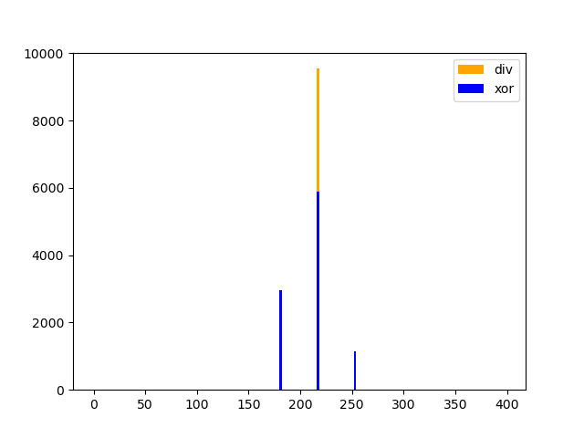

# Exercise 1: Measuring The Execution Time of Instructions

## Goal
In this exercise, your goal is to develop a histogram visualizing the timings of different instructions.
More precisely, of a x86 division (DIV) and a xor (XOR) instruction.

## Description
To solve the exercise, you have to implement the two TODOs inside `instruction_timing.c`.

## Compilation and Execution
You can build the code by executing the `make` command. This will compile the file `instruction_timing.c`.
Afterward, you can execute the file and view the results like the following:
```
./instruction_timing
python3 plot.py timings.log
```

A working solution could look like this:


